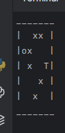
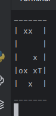
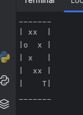
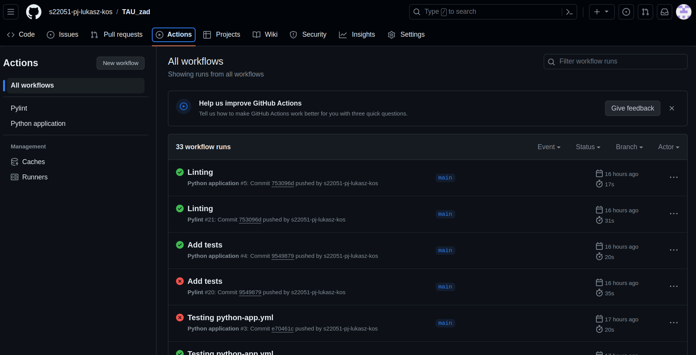

# Testowanie automatyczne (TAU)

## Laboratorium 1

Program w Java 11. Testy w JUnit5.

## Laboratorium 2

### Scenariusz testowy 1 (test_first_set)

- Strona: https://www.selenium.dev/selenium/web/web-form.html
- Kliknięcie w pole Text Input i wypełnienie go tekstem. Oszacowanie czy tekst się zgadza. 
- Kliknięcie w pole Password i wypełnienie go tekstem. Oszacowanie czy tekst się zgadza.
- Kliknięcie w pole Textarea i wypełnienie go tekstem. Oszacowanie czy tekst się zgadza. 
- Kliknięcie w Dropdown (select) i wybranie opcji "Two". Oszacowanie czy wartość się zgadza. 
- Kliknięcie w pole Dropdown (datalist) i wpisanie "Los". Oszacowanie czy fropdown zawiera tylko jeden element. 
- Kliknięcie w przycisk Submit i oszacowanie czy załadowała się kolejna strona. 

### Scenariusz testowy 2 (test_second_set)

- Strona: https://smakliter.pl/
- Kliknięcie w przycisk "Rozumiem" w banerze informującym o cookies
- Wpisanie w wyszukiwarkę "umówmy" i kliknięcie przycisku szukania
- Znalezienie książki "Umówmy się na Polskę"
- Dodanie jej do koszyka
- Kliknięcie przycisku "Przejdź do koszyka"
- Upewnienie się, że jesteś na odpowiedniej podstronie (/koszyk)

## Laboratorium 3 

Testowanie gry.
Gra w terminalu w polu 5x5. Pozycja gracza jest losowana w pierwszej kolumnie (o)
Następnie jest losowana pozycja skarbu w ostatniej kolumnie (T)
Potem następuje wylosowanie pozycji przeszkód (x). 
Celem gracza jest dotarcie do miejsca, gdzie znajduje się skarb.  
Gracz porusza się klawiszami 'w', 's', 'a', 'd'. Wciśnięcie klawisza 'q' wyłącza grę.  
Gra za każdym uruchomieniem wygląda inaczej.  
 
 
  
Do samej gry dopisano testy mające na celu sprawdzenie logiki gry.
Dodatkowo repozytorium spięto z GitHub Actions w celu sprawdzenia kodu i uruchamiania testów. 

## Laboratorium 4

Przepisz scenariusze testowe z Laboratorium 2 na Behave (implementacja Cucumber w Python)

Aby uruchomić testy należy zainstalować Behave
`pip install behave`

Następnie testy uruchamia się wpisując w terminal
`behave`
